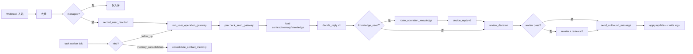
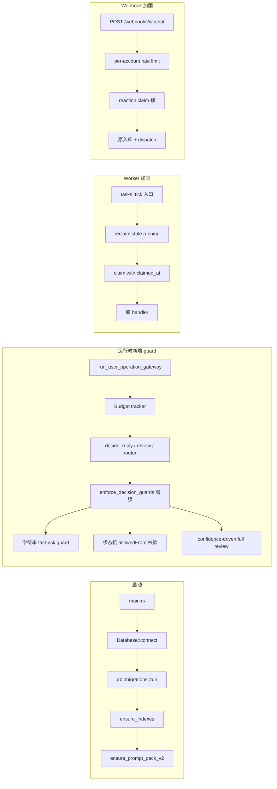

# Design Document

> 中文标题：用户运营 Agent 鲁棒性强化 — 技术设计文档
>
> 对应需求：见 `requirements.md`，覆盖 Requirement 1-20。
>
> **⚠️ Sunset Notice (2026-05-25)**：本设计文档中的 `enforce_string_fact_risk_guard` /
> `safe_claims` / `routing_card` / 5 闸阈值章节已在 knowledge-cleanup 中下线，
> 收敛为 3 闸 `enforce_knowledge_grounding / enforce_hallucination / enforce_run_budget`
> （详见 `src/agent/guards.rs`）。详见 `requirements.md` 顶部 sunset notice。

## Overview

本设计针对 20 项需求按"低风险先行"的顺序拆解技术方案。整体改造分四档优先级，每档对应一组明确的 Rust 模块改动、数据迁移和测试策略。设计的核心约束是：

- **行为兼容**：除了显式标注的 schema 演进（如 `last_inbound_at` / `claimed_at` / `allowedFrom` / `coreFacts` / `recentFacts`），所有现有 API 形状、URL、HTTP method、响应结构必须保持稳定。
- **数据迁移可重入**：通过新引入的 `db::migrations` 模块实现，每次启动幂等执行，不重复回填。
- **降级优先**：所有新引入的预算/限流/兜底机制都以"降级而非阻断"为默认行为，避免新增 guard 把健康场景误伤。
- **可观测性**：所有 guard 触发、预算超限、claim 回收、自动校验、dry-run 都通过 `agent_events` 留痕，便于事后审计。

## Architecture

### 现有链路（不变）



### 本次改造新增/修改的关键节点



### 模块拆分目标

```text
src/
├── main.rs
├── config.rs
├── error.rs
├── llm.rs                # 重写：指数退避、Retry-After、JSON 不重试
├── mcp.rs
├── models/               # 新拆模块：types-only（强类型 OperatingMemory 等）
│   ├── mod.rs
│   ├── memory.rs         # MemoryCard / coreFacts / recentFacts
│   ├── runtime.rs        # RuntimeParameters 强类型
│   └── ...
├── db/
│   ├── mod.rs            # Database 类型 + collection accessors
│   ├── indexes.rs        # ensure_indexes 移到此
│   └── migrations.rs     # 新增：版本化数据迁移
├── routes/               # LP-11 拆分目标
│   ├── mod.rs            # router 装配 + AppState
│   ├── shared.rs
│   ├── accounts.rs
│   ├── contacts.rs
│   ├── conversations.rs
│   ├── tasks.rs
│   ├── events.rs
│   ├── assets.rs
│   ├── knowledge.rs
│   ├── playbooks.rs
│   ├── domains.rs
│   ├── prompt_templates.rs
│   ├── souls.rs
│   ├── reviews.rs
│   ├── evaluations.rs    # 含 S-18 公式遵守度
│   ├── simulations.rs
│   ├── management.rs     # 含 S-20 dry-run
│   ├── guides.rs
│   ├── outcome_metrics.rs # S-19
│   └── health.rs
├── agent/                # LP-11 拆分目标
│   ├── mod.rs
│   ├── types.rs          # AgentDecision / FollowUpDecision / 等
│   ├── runtime.rs        # UserRuntimeParameters / Budget
│   ├── gateway.rs        # precheck_send_gateway / send_outbound
│   ├── decision.rs       # decide_reply
│   ├── review.rs         # review_decision
│   ├── knowledge_router.rs
│   ├── memory.rs         # operating memory + consolidation
│   ├── reaction.rs       # record_user_reaction + claim 锁
│   ├── simulation.rs
│   ├── guards.rs         # enforce_decision_guards 增强
│   └── budget.rs         # MP-5 预算追踪
├── webhooks.rs           # 加 rate limit
├── tasks.rs              # 加 reclaim
├── prompts.rs            # 改 group/moment seeded status + allowedFrom 默认
└── ...
```


## Components and Interfaces

### 1. Worker 超时回收（Requirement 1）

**模块：`src/tasks.rs`**

新增的 reclaim 流程在每次 tick 开头执行，且独立于普通任务 claim 逻辑。

```rust
// 简化签名
async fn reclaim_stale_running_tasks(state: &AppState) -> AppResult<usize> {
    let timeout = Duration::from_secs(state.config.task_claim_timeout_seconds);
    let process_started_at: DateTime = APP_STARTED_AT.get().copied().unwrap_or_else(DateTime::now);
    let stale_before = DateTime::from_millis(DateTime::now().timestamp_millis() - timeout.as_millis() as i64);

    // 找候选
    let filter = doc! {
        "status": "running",
        "$or": [
            { "claimed_at": { "$lt": stale_before } },
            { "claimed_at": { "$exists": false }, "updated_at": { "$lt": process_started_at } }
        ]
    };
    let cursor = state.db.tasks().find(filter, None).await?;
    // 逐条尝试 atomic compare-and-set
    let mut recovered = 0;
    while let Some(task) = cursor.try_next().await? {
        let res = state.db.tasks().update_one(
            doc! { "_id": task.id, "status": "running" },
            doc! {
                "$set": {
                    "status": "retry",
                    "gateway_status": "claim_timeout_recovered",
                    "next_retry_at": DateTime::now(),
                    "updated_at": DateTime::now()
                },
                "$inc": { "claim_recovery_count": 1 }
            },
            None,
        ).await?;
        if res.modified_count == 1 {
            recovered += 1;
            // 写 agent_events
            // 检查 24h 内 recovery 次数 ≥ 3 则标记为 failed
            // ...
        }
    }
    Ok(recovered)
}
```

**关键决策点**：

- **`APP_STARTED_AT`**：用 `tokio::sync::OnceCell` 在 `main` 启动时填充，存活整个进程，用于"进程启动晚于任务 updated_at 时跳过回收一次"的逻辑（避免误回收正在跑的任务）。
- **`claim_recovery_count`**：新字段记录该任务被回收次数；过去 24h 触达 3 次即视为永久故障，避免无限循环。具体判断：用 `agent_events` 集合按 `task_id + kind=task_claim_recovered + created_at >= now-24h` 计数。
- **配置项**：`AppConfig` 新增 `task_claim_timeout_seconds: u64`（默认 300，环境变量 `TASK_CLAIM_TIMEOUT_SECONDS`）。
- **Claim 时写 `claimed_at`**：把 `tasks::tick` 中现有的 claim `update_one` 加 `$set: { claimed_at: now }`。

### 2. last_message_at 拆分为 inbound/outbound（Requirement 2）

**模块：`src/models.rs`、`src/webhooks.rs`、`src/agent/gateway.rs`、`src/db/migrations.rs`**

```rust
// Contact 模型新增（保持原 last_message_at 不删）
pub struct Contact {
    // ... 既有字段 ...
    pub last_inbound_at: Option<DateTime>,
    pub last_outbound_at: Option<DateTime>,
    pub last_message_at: Option<DateTime>, // 自动维护：max(inbound, outbound)
    // ... 其它字段 ...
}
```

**写入路径**：

- `webhooks::wechat_webhook` 入站后：
  ```rust
  let now = DateTime::now();
  let set_doc = doc! {
      "last_inbound_at": now,
      "last_message_at": now,
      "updated_at": now
  };
  ```
- `agent::send_outbound_message` 出站后：
  ```rust
  let now = DateTime::now();
  // 用 aggregation pipeline update 计算 last_message_at = max(last_inbound_at, last_outbound_at)
  let pipeline = vec![doc! {
      "$set": {
          "last_outbound_at": now,
          "last_agent_run_at": now,
          "updated_at": now,
          "last_message_at": {
              "$max": ["$last_inbound_at", now]
          }
      }
  }];
  state.db.contacts().update_one_with_pipeline(filter, pipeline, None).await?;
  ```

**读取路径**：

- `precheck_send_gateway` 中 follow-up `context_changed` 检查改用 `last_inbound_at`：
  ```rust
  if let Some(last_inbound) = contact.last_inbound_at {
      if last_inbound.timestamp_millis() > task.created_at.timestamp_millis() {
          return Ok(blocked("context_changed", "用户在跟进任务后已有新消息"));
      }
  }
  ```

**数据迁移**（见 §Migrations 章节）：一次性把存量 `last_message_at` 复制到 `last_inbound_at`。

### 3. record_user_reaction claim 锁（Requirement 3）

**模块：`src/agent/reaction.rs`**

```rust
pub async fn record_user_reaction(
    state: &AppState,
    contact: &Contact,
    inbound: &ConversationMessage,
) -> AppResult<()> {
    // 先 atomic claim，把状态从 pending 改为 analyzing
    let claim_filter = doc! {
        "workspace_id": &contact.workspace_id,
        "account_id": &contact.account_id,
        "contact_wxid": &contact.wxid,
        "status": "sent",
        "$or": [
            { "outcome_status": null },
            { "outcome_status": "pending" }
        ]
    };
    let claim_update = doc! {
        "$set": {
            "outcome_status": "analyzing",
            "reaction_claimed_at": DateTime::now(),
        }
    };
    let res = state.db.decision_reviews()
        .find_one_and_update(claim_filter, claim_update, None)
        .await?;
    let Some(review) = res else { return Ok(()); }; // 没抢到锁就跳过

    // 调用 LLM 分析
    let reaction_analysis = analyze_user_reaction(state, contact, inbound, review.run_id.as_deref())
        .await
        .unwrap_or_else(|_| doc! { "outcomeStatus": "user_replied_unclassified", "confidence": 0 });

    let outcome = reaction_outcome_status(&reaction_analysis);
    state.db.decision_reviews().update_one(
        doc! { "_id": review.id },
        doc! {
            "$set": {
                "outcome_status": outcome,
                "reaction_analysis": reaction_analysis,
                "send_gateway_result.userReactionMessageId": inbound.message_id.clone().unwrap_or_default(),
                "send_gateway_result.userReactionAt": DateTime::now(),
            }
        },
        None,
    ).await?;
    Ok(())
}
```

**stuck 兜底**：每次 tick 或 webhook 处理时，对 `outcome_status="analyzing" AND reaction_claimed_at < now - REACTION_ANALYSIS_CLAIM_TIMEOUT_SECONDS` 的 review，把 `outcome_status` 重置为 `pending` 允许重新抢锁。这逻辑可以放到 `reclaim_stale_running_tasks` 同一个 tick 起点中。

### 4. LLM 重试改造（Requirement 4）

**模块：`src/llm.rs`**

```rust
fn is_retryable_llm_error(error: &AppError) -> bool {
    match error {
        AppError::Http(err) => err.is_timeout() || err.is_connect(),
        // 不再把 Json(_) 当可重试
        AppError::External(message) => {
            message.contains("LLM HTTP 429")
                || message.contains("LLM HTTP 500")
                || message.contains("LLM HTTP 502")
                || message.contains("LLM HTTP 503")
                || message.contains("LLM HTTP 504")
        }
        _ => false,
    }
}

// 指数退避带 jitter + Retry-After
async fn compute_backoff(
    attempt: u32,
    base_ms: u64,
    retry_after_secs: Option<u64>,
) -> Duration {
    let exp = base_ms.saturating_mul(1u64 << (attempt.saturating_sub(1).min(10)));
    let jitter = fastrand::u64(0..base_ms);
    let calc = exp.saturating_add(jitter);
    let final_ms = match retry_after_secs {
        Some(s) => calc.max(s.saturating_mul(1000)),
        None => calc,
    };
    Duration::from_millis(final_ms)
}

// 调用入口扩展返回值，记录 retry_count
pub struct LlmJsonResult {
    pub value: Value,
    pub usage: ChatUsage,
    pub latency_ms: i64,
    pub model: String,
    pub retry_count: u32,
}
```

**HTTP 解析变化**：`generate_json_once` 必须先取 `response.headers().get("retry-after")`，再拿 body。failure path 把这个值往上抛传。

**LlmCallLog 字段扩展**：新增 `retry_count: i32`、`final_status: String`（`"success"|"failed"|"json_error"`）。

### 5. 单 run 预算与降级链（Requirement 5）

**模块：`src/agent/budget.rs`、`src/agent/gateway.rs`、所有调 LLM 的子模块**

```rust
pub struct RunBudget {
    pub run_id: String,
    pub token_budget: i64,
    pub max_llm_calls: i32,
    pub tokens_used: i64,
    pub llm_calls_used: i32,
    pub degraded_reasons: Vec<String>,
}

impl RunBudget {
    pub fn from_runtime(runtime: &UserRuntimeParameters, run_id: &str) -> Self { ... }

    pub fn record_call(&mut self, usage: &ChatUsage) {
        self.tokens_used += usage.total_tokens;
        self.llm_calls_used += 1;
    }

    pub fn is_exceeded(&self) -> bool {
        self.tokens_used >= self.token_budget || self.llm_calls_used >= self.max_llm_calls
    }

    pub fn mark_degraded(&mut self, reason: impl Into<String>) {
        self.degraded_reasons.push(reason.into());
    }
}
```

**生命周期**：
- `run_user_operation_gateway` 在初始化时构造一个 `RunBudget` 实例，`Arc<Mutex<RunBudget>>` 形式传给所有子调用。
- 每次 `generate_agent_json` 返回后调 `budget.record_call(&usage)`，若 `is_exceeded()` 则函数返回新错误 `AppError::BudgetExceeded`，由调用方在子模块入口处捕获并降级。
- 每个降级点（review、rewrite、router 二次）封装为：
  ```rust
  if budget.lock().is_exceeded() {
      budget.lock().mark_degraded("review_skipped_budget_exceeded");
      return Ok(local_decision_review(&decision));
  }
  ```
- 写 `agent_run_logs` 时把 `tokens_used / llm_calls_used / degraded_reasons` 一并落库；触发降级时同步写 `agent_events kind="run_budget_exceeded"`。

**配置项**：`OperationDomainConfig.runtime_parameters` 增 `runTokenBudget: i64`（默认 30000）、`runMaxLlmCalls: i32`（默认 6）、`simulationTokenBudget: i64`（默认 60000）。

### 6. 字符串级 fact-risk guard（Requirement 6）

**模块：`src/agent/guards.rs`**

```rust
pub struct ProductClaimMarkers {
    pub markers: Vec<MarkerSpec>,    // 每条含 pattern (literal 或 regex) + reason
    pub whitelist_phrases: Vec<String>,
    pub whitelist_window_chars: usize, // 标记词左侧检查窗口
}

impl ProductClaimMarkers {
    pub fn scan(&self, reply_text: &str) -> Vec<MarkerHit> { ... }
    pub fn passes_whitelist(&self, hit: &MarkerHit) -> bool { ... }
}

pub fn enforce_string_fact_risk_guard(
    review: &mut DecisionReviewResult,
    decision: &AgentDecision,
    markers: &ProductClaimMarkers,
) {
    if !decision.should_reply { return; }
    if claim_is_marked_safe_by_model(&review.claim_analysis) { return; }
    if !decision.used_knowledge_ids.is_empty() || !decision.safe_claims_used.is_empty() { return; }

    let hits = markers.scan(&decision.reply_text);
    let real_hits: Vec<_> = hits.into_iter().filter(|h| !markers.passes_whitelist(h)).collect();
    if real_hits.is_empty() { return; }

    review.scores.fact_risk = review.scores.fact_risk.max(6);
    review.scores.product_accuracy = review.scores.product_accuracy.min(6);
    for hit in &real_hits {
        review.risks.push(format!("string_guard: 命中标记 [{}]，但本次未引用知识切片或安全声明", hit.matched_text));
    }
}
```

**配置加载**：新增 prompt template key `user.review.product_claim_markers`，其 content 是 JSON：
```json
{
  "markers": [
    { "pattern": "literal:保证", "reason": "绝对化承诺" },
    { "pattern": "literal:一定能", "reason": "绝对化承诺" },
    { "pattern": "literal:绝对", "reason": "绝对化承诺" },
    { "pattern": "regex:\\d+\\s*(%|％|折)", "reason": "数字百分比/折扣" },
    { "pattern": "regex:[¥￥]\\s*\\d+|\\d+\\s*(元|万|亿|RMB|rmb)", "reason": "价格金额" },
    { "pattern": "literal:案例", "reason": "可能引用未支撑案例" },
    { "pattern": "literal:成功率", "reason": "效果数据" },
    { "pattern": "literal:见效", "reason": "效果承诺" },
    { "pattern": "literal:回款", "reason": "效果承诺" }
  ],
  "whitelistPhrases": ["准时", "按时", "尊重", "保护", "你的"],
  "whitelistWindowChars": 8
}
```

启动时读取，缓存到 `AppState`（`Arc<RwLock<ProductClaimMarkers>>`），后台编辑 prompt template 后同步刷新。

### 7. 状态机 allowedFrom 校验（Requirement 7）

**模块：`src/prompts.rs`、`src/agent/guards.rs`、`src/models/runtime.rs`**

`prompts::default_user_operation_state_machine` 的 9 个 state 都加 `allowedFrom`/`allowFromAny` 字段。`OperationDomainConfig.state_machine.states[i]` 反序列化为：

```rust
pub struct OperationStateSpec {
    pub key: String,
    pub name: String,
    #[serde(default)]
    pub allowed_from: Vec<String>,
    #[serde(default)]
    pub allow_from_any: bool,
    // ... 其它现有字段 ...
}
```

`enforce_decision_guards` 中：
```rust
fn check_state_transition(
    decision: &AgentDecision,
    contact: &Contact,
    config: &OperationDomainConfig,
) -> Option<String> {
    let to = decision.operation_state.as_deref()?;
    let from = contact.operation_state.as_deref().unwrap_or("");
    let states = parse_state_machine(&config.state_machine);
    let target = states.iter().find(|s| s.key == to)?;
    if target.allow_from_any { return None; }
    if from.is_empty() {
        if to == "new_contact" { return None; }
        return Some(format!("state_transition_invalid: from=<empty> to={to}"));
    }
    if target.allowed_from.iter().any(|f| f == from) { return None; }
    Some(format!("state_transition_invalid: from={from} to={to}"))
}
```

非法时把 `review.scores.fact_risk` 拉到 ≥6、`review.approved=false`，并 push 一条 `risks`。

### 8. memoryCard 拆分 coreFacts/recentFacts（Requirement 8）

**模块：`src/models/memory.rs`、`src/agent/memory.rs`、`src/prompts.rs`、`src/db/migrations.rs`**

```rust
pub struct MemoryCard {
    pub core_profile: MemoryCardCoreProfile,
    pub relationship_state: MemoryCardRelationshipState,
    pub core_facts: Vec<String>,        // cap 6
    pub recent_facts: Vec<String>,      // cap 10
    pub preferences: Vec<String>,
    pub do_not_do: Vec<String>,
    pub commitments: Vec<String>,
    pub objections: Vec<String>,
    pub open_loops: Vec<String>,
    pub recent_episode_summary: String,
    pub deprecated_facts: Vec<Document>,
    pub conflicts: Vec<Document>,
    pub source: String,
    pub version: i32,
}
```

**`compact_memory_card`** 改造：
```rust
fn compact_memory_card(
    incoming: &MemoryCard,
    previous: Option<&MemoryCard>,
    discarded: &[String],
) -> MemoryCard {
    let mut out = incoming.clone();
    // coreFacts: 合并语义；除非在 discarded 里显式 deprecate，否则保留 previous 中的 coreFact
    if let Some(prev) = previous {
        for fact in &prev.core_facts {
            if !discarded.iter().any(|d| d == fact) && !out.core_facts.contains(fact) {
                out.core_facts.push(fact.clone());
            }
        }
    }
    // 按 importance 倒序保留前 N
    out.core_facts.sort_by(|a, b| importance_of(b).cmp(&importance_of(a)));
    out.core_facts.truncate(6);
    out.recent_facts.truncate(10);  // 新近性已由 consolidator 排序
    // 其它数组同样按 importance 截留
    out
}
```

**Consolidator prompt 升级**：`user.memory_consolidator.task` 增加要求模型按 importance 倒序输出每个数组、显式区分 coreFacts/recentFacts、把要 deprecate 的 fact 放 `discarded` 里。

**数据迁移**：`migrations` 模块把存量 `activeFacts` 拆分到 `coreFacts[0..6]` + `recentFacts[6..]`。

### 9. 知识库未验证告警与 auto-verify（Requirement 9）

**模块：`src/agent/knowledge_router.rs`、`src/routes/knowledge.rs`**

启动告警：
```rust
async fn maybe_emit_unverified_warning(
    state: &AppState,
    contact: &Contact,
    knowledge: &KnowledgeRuntime,
) -> AppResult<()> {
    let total = knowledge.chunks.len() + knowledge.items.len();
    if total == 0 { return Ok(()); }
    let verified = knowledge.chunks.iter().filter(|c| c.integrity_status.as_deref() == Some("verified")).count();
    if verified > 0 { return Ok(()); }
    // 当日去重
    let today_start = today_start_datetime();
    let exists = state.db.events().find_one(doc! {
        "workspace_id": &contact.workspace_id,
        "account_id": &contact.account_id,
        "contact_wxid": &contact.wxid,
        "kind": "knowledge_unverified_warning",
        "created_at": { "$gte": today_start }
    }, None).await?;
    if exists.is_some() { return Ok(()); }
    write_event_for_account(state, &contact.account_id, Some(&contact.wxid),
        "knowledge_unverified_warning", "warn",
        "知识库存在未验证切片，运行时不会注入；建议运行 auto-verify 或人工校验",
        Some(doc! { "totalChunks": knowledge.chunks.len() as i32, ... })).await?;
    Ok(())
}
```

Auto-verify 接口：`POST /api/operation-knowledge/auto-verify`：
- 输入：`accountId`, `confidenceThreshold` (默认 7), `humanAuditSampleRate` (默认 0.1)
- 串行处理 `needs_review` chunks，每条调 LLM `knowledge.auto_verify` prompt 评估 confidence
- 受 MP-5 全局预算约束，超额返回 `{ processed: N, remaining: M, status: "degraded" }`
- 写 `agent_events kind="knowledge_auto_verify_done"`
- 实现复用 `simulate_user_dialogue` 一样的 budget 包装

新 prompt key `knowledge.auto_verify`：要求模型读 chunk 与原始切片源（来自 `source_anchors`），输出 `{ confidenceScore: 0-10, integrityStatus: "verified"|"needs_review"|"rejected", verifiedClaims: [...], distortionRisks: [...] }`。

### 10. operation_state_confidence 触发 full review（Requirement 10）

**模块：`src/agent/runtime.rs`、`src/agent/gateway.rs`**

```rust
pub fn effective_review_mode(
    planner: &RunPlannerResult,
    decision: &AgentDecision,
    runtime: &UserRuntimeParameters,
    force_full: bool,
) -> &'static str {
    if force_full { return "full"; }
    let confidence = decision.operation_state_confidence.unwrap_or(10);
    if confidence < runtime.operation_state_confidence_full_review_below {
        return "full";
    }
    // 既有判定
    if planner.risk_level == "high" || planner.knowledge_required { return "full"; }
    if planner.review_mode == "light" { return "light"; }
    "full"
}
```

`agent_run_logs.planner.confidence_override_triggered` 在 trigger 时写 `true`。`UserRuntimeParameters` 增字段 `operation_state_confidence_full_review_below: i32`（默认 4）。


### 11. Mega 文件拆分（Requirement 11）

**操作流程**：

1. **先补齐测试（Requirement 16）再拆分**——强制依赖关系，避免拆分破坏未发现的边界。
2. 每次只拆一个子模块，跑 `cargo check` 后 commit；逐个 PR-style commit 完成。
3. 公共 helper（如 `parse_object_id`、`stable_text_hash`）放 `routes/shared.rs` 或 `agent/types.rs`。

**拆分对应表**：见 §Architecture 章节的目录树。每个子模块加 `//! 中文 doc-comment` 说明职责。

**保持 public API 不变的策略**：
- `pub use` 在 `mod.rs` 重新导出原 `routes.rs` / `agent.rs` 的所有 pub 项。
- `AppState`、`run_user_operation_gateway`、`api_router`、`send_contact_message_gateway` 等 cross-module 符号在新位置维持原可见性。
- `agent::generate_agent_json` 仍保持 `pub(crate)`。

### 12. 强类型化核心 Document 字段（Requirement 12）

**模块：`src/models/`**

新增类型：

```rust
// src/models/runtime.rs
#[derive(Debug, Clone, Serialize, Deserialize)]
#[serde(rename_all = "camelCase")]
pub struct RuntimeParameters {
    #[serde(default = "defaults::recent_message_limit")]
    pub recent_message_limit: i64,
    #[serde(default = "defaults::min_reply_interval_seconds")]
    pub min_reply_interval_seconds: i64,
    #[serde(default = "defaults::max_daily_touches")]
    pub max_daily_touches: i64,
    #[serde(default = "defaults::max_pending_follow_ups")]
    pub max_pending_follow_ups: i64,
    #[serde(default = "defaults::follow_up_expires_hours")]
    pub follow_up_expires_hours: i64,
    #[serde(default = "defaults::cooldown_after_no_reply_hours")]
    pub cooldown_after_no_reply_hours: i64,
    #[serde(default = "defaults::fact_risk_block_at")]
    pub fact_risk_block_at: i32,
    #[serde(default = "defaults::pressure_risk_block_at")]
    pub pressure_risk_block_at: i32,
    #[serde(default = "defaults::human_like_rewrite_below")]
    pub human_like_rewrite_below: i32,
    #[serde(default = "defaults::emotional_value_rewrite_below")]
    pub emotional_value_rewrite_below: i32,
    #[serde(default = "defaults::product_accuracy_block_below")]
    pub product_accuracy_block_below: i32,
    // 本次新增
    #[serde(default = "defaults::run_token_budget")]
    pub run_token_budget: i64,
    #[serde(default = "defaults::run_max_llm_calls")]
    pub run_max_llm_calls: i32,
    #[serde(default = "defaults::simulation_token_budget")]
    pub simulation_token_budget: i64,
    #[serde(default = "defaults::operation_state_confidence_full_review_below")]
    pub operation_state_confidence_full_review_below: i32,
    // 兜底：未识别字段被丢弃，但 BSON->JSON->camelCase 形状不变
}

impl From<RuntimeParameters> for Document {
    fn from(p: RuntimeParameters) -> Self {
        mongodb::bson::to_document(&p).expect("RuntimeParameters serializable")
    }
}
```

类似定义 `MemoryCard`、`MemoryCardCoreProfile`、`MemoryCardRelationshipState`、`UserUnderstanding`、`ProductFit`、`NextActionMemory`。

**渐进迁移策略**：保留 `OperationDomainConfig.runtime_parameters: Document` 不动一段时间，提供 `OperationDomainConfig::runtime_parameters_typed(&self) -> RuntimeParameters` 辅助方法，新代码用强类型，老代码继续读 Document。后续小迭代再把 `runtime_parameters` 字段类型本身换掉。

### 13. 缺失索引（Requirement 13）

**模块：`src/db/indexes.rs`** 新增以下索引创建：

```rust
self.accounts().create_index(
    IndexModel::builder()
        .keys(doc! { "app_id": 1 })
        .options(IndexOptions::builder().sparse(true).build())
        .build(),
    None,
).await?;

self.tasks().create_index(
    IndexModel::builder()
        .keys(doc! { "workspace_id": 1, "account_id": 1, "contact_wxid": 1, "kind": 1, "status": 1 })
        .build(),
    None,
).await?;

self.decision_reviews().create_index(
    IndexModel::builder()
        .keys(doc! { "workspace_id": 1, "account_id": 1, "contact_wxid": 1, "status": 1, "outcome_status": 1 })
        .options(IndexOptions::builder()
            .partial_filter_expression(doc! { "outcome_status": { "$in": ["pending", "analyzing"] } })
            .build())
        .build(),
    None,
).await?;

self.events().create_index(
    IndexModel::builder()
        .keys(doc! { "workspace_id": 1, "account_id": 1, "contact_wxid": 1, "created_at": -1 })
        .build(),
    None,
).await?;
```

所有索引创建集中在 `ensure_indexes`，运行时其它路径不再调用 `create_index`。

### 14. Webhook 限流（Requirement 14）

**模块：`src/webhooks.rs`、`src/config.rs`**

引入 `governor` crate 实现 per-key 令牌桶：

```toml
# Cargo.toml
governor = "0.7"
```

```rust
// 全局静态
static WEBHOOK_LIMITERS: LazyLock<DashMap<String, Arc<DefaultDirectRateLimiter>>> =
    LazyLock::new(|| DashMap::new());

fn limiter_for(account_id: &str, capacity: u32, window_seconds: u32) -> Arc<DefaultDirectRateLimiter> {
    WEBHOOK_LIMITERS.entry(account_id.to_string()).or_insert_with(|| {
        let quota = Quota::with_period(Duration::from_secs(window_seconds as u64))
            .unwrap()
            .allow_burst(NonZeroU32::new(capacity).unwrap());
        Arc::new(RateLimiter::direct(quota))
    }).clone()
}

pub async fn wechat_webhook(
    State(state): State<AppState>,
    Json(payload): Json<Value>,
) -> AppResult<Json<Value>> {
    let app_id = find_string(&payload, &["appId", "app_id", "appid"]);
    let (workspace_id, account_id) = resolve_account_context(&state, app_id.as_deref()).await?;

    let limiter = limiter_for(&account_id, state.config.webhook_rate_limit_capacity, state.config.webhook_rate_limit_window_seconds);
    if let Err(neg) = limiter.check() {
        let retry_after = neg.wait_time_from(governor::clock::DefaultClock::default().now()).as_secs() + 1;
        // 写当日去重的 agent_events
        maybe_emit_rate_limit_event(&state, &account_id).await.ok();
        return Err(AppError::RateLimited { retry_after, account_id });
    }
    // ... 原流程 ...
}
```

`AppError::RateLimited` 在 `IntoResponse` 实现里返回 HTTP 429 + `Retry-After` header + `{"error": "rate_limited", "account_id": "..."}` body。

`AppConfig` 新增 `webhook_rate_limit_window_seconds: u32`（默认 60）和 `webhook_rate_limit_capacity: u32`（默认 30）。

### 15. LLM_EXACT_CACHE 替换为 LRU（Requirement 15）

**模块：`src/agent/decision.rs`（generate_agent_json 所在处）**

```toml
# Cargo.toml
lru = "0.12"
parking_lot = "0.12"
```

```rust
use lru::LruCache;
use parking_lot::Mutex as PlMutex;

static LLM_EXACT_CACHE: LazyLock<PlMutex<LruCache<String, Value>>> =
    LazyLock::new(|| PlMutex::new(LruCache::new(NonZeroUsize::new(256).unwrap())));

// 命中
fn cache_get(key: &str) -> Option<Value> {
    LLM_EXACT_CACHE.lock().get(key).cloned()
}

fn cache_put(key: String, value: Value) {
    LLM_EXACT_CACHE.lock().put(key, value);
}
```

调用方代码不变，命中时仍写 `llm_call_logs.status = "cache_hit"`。`parking_lot::Mutex` 在 sync 上下文调用，`get/put` 不跨 await，避免 tokio 调度坑。

### 16. 测试覆盖（Requirement 16）

**Crate 依赖**：

```toml
[dev-dependencies]
mockall = "0.13"
proptest = "1.5"
testcontainers = "0.23"          # MongoDB 容器（仅集成测试）
testcontainers-modules = { version = "0.11", features = ["mongo"] }
serde_json = "1"
tokio = { version = "1", features = ["macros", "rt-multi-thread", "test-util"] }
```

**目录布局**：

```text
src/
├── ... (代码) ...
└── tests/
    └── (集成测试用 #[ignore]，需要 docker)

tests/                           # crate 级集成测试
├── happy_path_run.rs           # mock LLM + 内存 Mongo, run_user_operation_gateway
├── worker_reclaim.rs           # HP-1 回归
├── last_inbound_split.rs       # HP-2 回归
├── reaction_claim_lock.rs      # HP-3 回归
├── llm_retry_jitter.rs         # HP-4 回归
├── string_fact_risk_guard.rs   # MP-6
├── state_transition_pbt.rs     # MP-7 PBT
├── memory_card_invariants.rs   # MP-8 PBT
└── dry_run_isolation.rs        # S-20
```

**Mock LLM 抽象**：把 `LlmClient` 改为 trait + impl：

```rust
#[async_trait]
pub trait LlmGenerator: Send + Sync {
    async fn generate_json_with_usage(&self, system: &str, user: &str) -> AppResult<LlmJsonResult>;
}

pub struct LlmClient { /* 原实现 */ }
impl LlmGenerator for LlmClient { ... }

// AppState 持有 Arc<dyn LlmGenerator>
```

mockall 自动生成 `MockLlmGenerator`，集成测试中预置返回值。

**PBT 示例（状态机迁移）**：

```rust
proptest! {
    #[test]
    fn state_transition_guard_respects_allowed_from(
        from in proptest::sample::select(STATE_KEYS),
        to in proptest::sample::select(STATE_KEYS),
    ) {
        let domain = build_test_domain_config();
        let target = state_spec(&domain, &to);
        let should_allow = target.allow_from_any
            || target.allowed_from.iter().any(|f| f == &from)
            || (from.is_empty() && to == "new_contact");
        let blocked = check_state_transition_blocked(&from, &to, &domain);
        prop_assert_eq!(should_allow, !blocked);
    }
}
```

**测试运行时间约束**：单次 `cargo test` 不超过 90 秒；用 `#[ignore]` 把 testcontainers 集成测试隔离到 `cargo test -- --ignored`。

### 17. group/moment 种子状态改 draft（Requirement 17）

**模块：`src/prompts.rs`**

```rust
fn soul_specs() -> Vec<SoulSpec> {
    vec![
        SoulSpec { kind: "user", status: "published", ... },
        SoulSpec { kind: "management", status: "published", ... },
        SoulSpec { kind: "group", status: "draft", ... },
        SoulSpec { kind: "moment", status: "draft", ... },
    ]
}
```

`SoulSpec` / `PromptSpec` 都新增 `status: &'static str` 字段，写库时直接用，不再硬编码 `"published"`/`"active"`。

`ensure_prompt_pack_v2` 检测"已存在"逻辑：
```rust
let exists = db.prompt_templates().find_one(doc! {
    "workspace_id": workspace_id,
    "prompt_pack_version": PROMPT_PACK_VERSION,
    "status": { "$in": ["active", "draft"] }   // 把 draft 也算
}, None).await?;
if exists.is_some() {
    delete_redundant_prompt_data(db, workspace_id).await?;
    return Ok(());
}
```

**容错（Requirement 17.4）**：
- 该 `find_one` 包在 `match` 里：发生 DB 异常或返回非预期 schema 时，进入 `reset_prompt_pack_v2` 重新种入；写一条 `agent_events kind="prompt_pack_reseed_fallback"` 留痕；UI 提供"清理重复模板"操作（已有 prompt_templates 列表 + delete 操作可承担）。

UI 改造（Requirement 17.5/17.6）：在 `frontend/src/App.tsx` 的 souls/prompt 列表组件中，对 `status === "draft"` 行加灰色 badge，sortBy 把 `status` 升序排列（`active < draft < archived`）。`groupOps`/`momentOps` 频道的 `NextPhasePanel` 文案改为"对应 Soul 与 Prompt 已存在但运行时未实现，可在系统策略页查看草稿模板"。

### 18. 公式遵守度评测脚手架（Requirement 18）

**模块：`src/routes/evaluations.rs`、`src/db.rs`、新集合 `evaluation_scenarios`**

数据模型：

```rust
#[derive(Debug, Clone, Serialize, Deserialize)]
pub struct EvaluationScenario {
    #[serde(rename = "_id", skip_serializing_if = "Option::is_none")]
    pub id: Option<ObjectId>,
    pub workspace_id: String,
    pub scenario_id: String,
    pub title: String,
    pub description: String,
    pub account_id: Option<String>,
    pub contact_seed: Document,        // 用于构造临时 Contact 的关键字段
    pub inbound_messages: Vec<String>,
    pub ground_truth: GroundTruth,
    pub tags: Vec<String>,
    pub status: String,                // "active" | "archived"
    pub created_at: DateTime,
    pub updated_at: DateTime,
}

pub struct GroundTruth {
    pub trust: i32,
    pub conversion_readiness: i32,
    pub emotional_value: i32,
    pub next_best_action_score: i32,
    pub notes: String,
}
```

接口：

- `POST /api/evaluation-scenarios` / `GET /api/evaluation-scenarios` / `PUT /api/evaluation-scenarios/:id` / `DELETE /api/evaluation-scenarios/:id`
- `POST /api/user-operations/evaluations/formula-adherence`
  - body: `{ accountId: String, scenarioIds?: Vec<String>, tags?: Vec<String> }`
  - 实现：
    1. 加载场景（无场景时降级返回 `200 OK + degraded:true`，按 Requirement 18.7）
    2. 对每个场景构造临时 Contact 调 `simulate_user_dialogue`
    3. 抓最后一 turn 的 `decision.formula_breakdown` + `review.scores`，提取四个公式分数
    4. 计算偏差：`abs(predicted - ground_truth)` 与方向一致性
    5. 单场景 adherence_score = `1 - mean(|delta|)/10`
    6. 写 `agent_events kind="formula_adherence_evaluated"` + 返回结果

`simulate_user_dialogue` 已经受 budget 约束，复用即可。本次内置至少一个示例场景：`scenario_id="example_high_intent_user"`，content 在 `prompts.rs` 同样集中维护，初始数据通过 `ensure_evaluation_scenarios` 在启动时种入（与 prompt pack 类似的幂等检测）。

### 19. 长 horizon outcome 指标（Requirement 19）

**模块：`src/tasks.rs`、新集合 `agent_outcome_metrics`、`src/routes/outcome_metrics.rs`**

新 task kind `outcome_aggregation`：

```rust
// task content：JSON: { "horizon": "7d" | "30d", "date": "YYYY-MM-DD" }
// 调度：tasks::tick 启动时检测当日是否已有任务；没有则插入
async fn ensure_today_outcome_aggregation_tasks(state: &AppState) -> AppResult<()> {
    let today = today_date_string();
    for horizon in ["7d", "30d"] {
        let existing = state.db.tasks().find_one(doc! {
            "kind": "outcome_aggregation",
            "content": format!("{{\"horizon\":\"{horizon}\",\"date\":\"{today}\"}}"),
        }, None).await?;
        if existing.is_some() { continue; }
        // 为每个 workspace + account 插一条
        let mut accounts = state.db.accounts().find(doc! {}, None).await?;
        while let Some(account) = accounts.try_next().await? {
            state.db.tasks().insert_one(AgentTask { ... kind: "outcome_aggregation", ... }, None).await?;
        }
    }
    Ok(())
}
```

聚合 handler 计算指标：
- `reply_rate_7d/30d`：`SUM(出站后 7/30d 内有入站) / SUM(出站消息总数)`
- `conversation_depth`：`AVG(per managed contact, COUNT(inbound today))`
- `human_handoff_success_rate`：`COUNT(events kind=human_handoff AND contact later -> customer_success) / COUNT(events kind=human_handoff)`
- `agent_block_rate`：`COUNT(decision_reviews status=blocked today) / COUNT(decision_reviews today)`
- `daily_run_count`、`daily_run_token_total`

写 `agent_outcome_metrics`，文档 `_id = "{account_id}:{horizon}:{date}"` 实现幂等。

TTL 索引：`{ created_at: 1 }` + `expireAfterSeconds = 90 days`，可通过 `OUTCOME_METRICS_TTL_DAYS` 配置。

接口 `GET /api/agent-outcome-metrics?accountId=&horizon=7d|30d&fromDate=&toDate=` 返回时间序列数组。

### 20. Management Agent dry-run 模式（Requirement 20）

**模块：`src/routes/management.rs`**

数据模型：
- `ManagementAgentSession.dry_run: bool`（默认 false）
- `ManagementMessageRequest.dry_run: Option<bool>`

**`execute_management_tool` 入口**：

```rust
async fn execute_management_tool(
    state: &AppState,
    account_id: &str,
    planned: &PlannedToolCall,
    effective_dry_run: bool,
) -> AppResult<Value> {
    if effective_dry_run && !is_read_tool(&planned.tool_name) {
        // 对 send_contact_message 单独处理：尝试 apply_locked_send_content 但不实际发送
        let extracted_content = extract_for_dry_run(planned);
        return Ok(json!({
            "dry_run": true,
            "would_execute": {
                "toolName": planned.tool_name,
                "arguments": extracted_content.unwrap_or_else(|err| json!({
                    "extraction_error": err.to_string(),
                    "raw_arguments": planned.arguments.clone(),
                })),
                "error": null,
            }
        }));
    }
    // 原实际执行逻辑
}

fn is_read_tool(tool_name: &str) -> bool {
    matches!(tool_name,
        "account_list"
        | "contacts_search"
        | "knowledge.search"
        | "knowledge.list_catalog"
        | "wechatagent.search_contacts"
    ) || tool_name.starts_with("knowledge.open")
}
```

**Plan 流转**：`post_management_message` 计算 `effective_dry_run = request.dry_run.unwrap_or(session.dry_run)`，传递给 `execute_management_tool`；`agent_command_runs.status` 设为 `"dry_run"`、`agent_tool_calls.status` 设为 `"dry_run"`。

UI 改造（Requirement 20.7）：session 创建表单加 checkbox（持久化字段），单条消息发送区可临时勾选；session 详情顶部固定显示当前模式徽章（绿色"实操模式" / 蓝色"Dry-run 模式"）。


## Data Models

### 新增/修改字段汇总

| 集合 | 字段 | 类型 | 说明 | 对应需求 |
|---|---|---|---|---|
| `contacts` | `last_inbound_at` | `Option<DateTime>` | 仅入站消息更新 | 2 |
| `contacts` | `last_outbound_at` | `Option<DateTime>` | 仅出站消息更新 | 2 |
| `contacts` | `last_message_at` | 兼容字段 | `max(inbound, outbound)`，自动维护 | 2 |
| `agent_tasks` | `claimed_at` | `Option<DateTime>` | claim 时写当前时间 | 1 |
| `agent_tasks` | `claim_recovery_count` | `i32` | 24h 内 ≥3 即标 failed | 1 |
| `agent_decision_reviews` | `outcome_status` | 扩枚举 | 新增 `"analyzing"` | 3 |
| `agent_decision_reviews` | `reaction_claimed_at` | `Option<DateTime>` | 反应分析 claim 锁的时间戳 | 3 |
| `agent_run_logs` | `token_budget` | `i64` | 单 run 预算 | 5 |
| `agent_run_logs` | `tokens_used` | `i64` | 实际消耗 | 5 |
| `agent_run_logs` | `llm_calls_used` | `i32` | LLM 调用计数 | 5 |
| `agent_run_logs` | `degraded_reasons` | `Vec<String>` | 触发降级原因 | 5 |
| `llm_call_logs` | `retry_count` | `i32` | LLM 客户端重试次数 | 4 |
| `llm_call_logs` | `final_status` | `String` | success / failed / json_error | 4 |
| `operating_memories` | `memory_card.coreFacts` | `Vec<String>` | cap 6 | 8 |
| `operating_memories` | `memory_card.recentFacts` | `Vec<String>` | cap 10 | 8 |
| `operating_memories` | `memory_card.activeFacts` | 移除 | 数据迁移到 coreFacts/recentFacts | 8 |
| `operation_domain_configs` | `state_machine.states[].allowedFrom` | `Vec<String>` | 合法迁移源列表 | 7 |
| `operation_domain_configs` | `state_machine.states[].allowFromAny` | `bool` | 允许任意状态进入（cooldown） | 7 |
| `operation_domain_configs` | `runtime_parameters.runTokenBudget` | `i64` | 默认 30000 | 5 |
| `operation_domain_configs` | `runtime_parameters.runMaxLlmCalls` | `i32` | 默认 6 | 5 |
| `operation_domain_configs` | `runtime_parameters.simulationTokenBudget` | `i64` | 默认 60000 | 5 |
| `operation_domain_configs` | `runtime_parameters.operationStateConfidenceFullReviewBelow` | `i32` | 默认 4 | 10 |
| `evaluation_scenarios` | （新集合） | 见 §18 | 公式遵守度场景库 | 18 |
| `agent_outcome_metrics` | （新集合） | 见 §19 | 长 horizon 指标 | 19 |
| `migrations` | `version` / `applied_at` | `String` / `DateTime` | 迁移版本表 | 2/8 |
| `management_agent_sessions` | `dry_run` | `bool` | 默认 false | 20 |
| `agent_command_runs` | `status` | 扩枚举 | 新增 `"dry_run"` | 20 |
| `agent_tool_calls` | `status` | 扩枚举 | 新增 `"dry_run"` | 20 |

### Migrations 模块

```rust
// src/db/migrations.rs
pub async fn run(db: &Database) -> AppResult<()> {
    let registry = collection_migrations(db);
    for migration in MIGRATIONS {
        if registry.find_one(doc! { "_id": migration.id }, None).await?.is_some() {
            continue;
        }
        (migration.run)(db).await?;
        registry.insert_one(doc! { "_id": migration.id, "applied_at": DateTime::now() }, None).await?;
        tracing::info!(migration_id = migration.id, "migration applied");
    }
    Ok(())
}

struct Migration {
    id: &'static str,
    run: fn(&Database) -> Pin<Box<dyn Future<Output = AppResult<()>> + Send + '_>>,
}

const MIGRATIONS: &[Migration] = &[
    Migration {
        id: "2026_05_001_split_last_message_at",
        run: |db| Box::pin(async move {
            db.contacts().update_many(
                doc! { "last_inbound_at": { "$exists": false }, "last_message_at": { "$exists": true } },
                vec![doc! { "$set": { "last_inbound_at": "$last_message_at" } }],
                None,
            ).await?;
            Ok(())
        }),
    },
    Migration {
        id: "2026_05_002_split_active_facts",
        run: |db| Box::pin(async move {
            // 把 memory_card.activeFacts 拆到 coreFacts[0..6] / recentFacts[6..]
            // 用聚合管道完成；细节略
            Ok(())
        }),
    },
];
```

`Database::connect` 后 `ensure_indexes` 前调用 `migrations::run`。

## Error Handling

### 新增错误变体

```rust
// src/error.rs
pub enum AppError {
    BadRequest(String),
    NotFound(String),
    Db(mongodb::error::Error),
    Http(reqwest::Error),
    Json(serde_json::Error),
    BsonSer(mongodb::bson::ser::Error),
    External(String),

    // 新增
    RateLimited { retry_after: u64, account_id: String },
    BudgetExceeded { run_id: String, reason: String },
}
```

`IntoResponse` 实现：
- `RateLimited` → HTTP 429 + `Retry-After` header + 标准 body
- `BudgetExceeded` → 内部错误，不暴露给 webhook 调用者；管理 API 返回 HTTP 503

### 降级策略

| 触发场景 | 行为 |
|---|---|
| `BudgetExceeded` 在 review 阶段 | 调用 `local_decision_review` 替代 |
| `BudgetExceeded` 在 rewrite 阶段 | 跳过 rewrite，用第一次 review 结果 |
| `BudgetExceeded` 在 router 二次决策前 | 复用第一次决策结果 |
| `BudgetExceeded` 在 reaction analysis | 把 outcome_status 直接写 `user_replied_unclassified`，不调 LLM |
| LLM JSON 解析错误 | 不重试，立即降级到 `local_decision_review`（review 路径）或回退场景判定（其它路径） |
| `evaluation_scenarios` 为空 | 接口返回 `200 OK` + `degraded: true, reason: "no_scenarios"` |
| 知识库 verified 为 0 | 不阻断 run，写 `knowledge_unverified_warning` 事件并继续 |
| Webhook 限流命中 | HTTP 429，写当日去重事件 |
| Worker 超时回收 ≥3 次 | 标记 `failed`，写 `claim_recovery_exhausted` 事件 |
| Prompt pack 检测失败 | 重新种入 + 写 `prompt_pack_reseed_fallback` 事件 |

## Testing Strategy

### 测试金字塔

```text
            ┌──────────────────────────┐
            │  集成测试（少量、慢）       │
            │  - happy_path_run         │
            │  - dry_run_isolation      │
            │  - worker_reclaim         │
            │  - llm_retry_jitter       │
            └─────────────┬────────────┘
                          │
        ┌─────────────────┴────────────────┐
        │  属性测试 PBT（中量、中等）         │
        │  - state_transition_pbt          │
        │  - memory_card_invariants        │
        │  - reaction_claim_pbt            │
        └─────────────────┬────────────────┘
                          │
       ┌──────────────────┴───────────────────┐
       │  单元测试（多量、快）                   │
       │  - string_fact_risk_guard 正反 case   │
       │  - allowedFrom 常规 case              │
       │  - last_inbound_split 正反 case       │
       │  - retry backoff 计算                 │
       │  - confidence_full_review            │
       │  - budget tracker                    │
       └──────────────────────────────────────┘
```

### 关键测试

1. **HP-1 Worker 回收回归**：构造 `running` + `claimed_at < now-301s`，run `tasks::tick`，断言任务变 `retry`，`agent_events` 写入。
2. **HP-2 last_inbound_at 分流**：插入 contact，调 webhook → assert `last_inbound_at == last_message_at == now`；调 `send_outbound_message` → assert `last_outbound_at == now`、`last_inbound_at` 不变；构造 follow-up task `created_at = T-1h`，更新 `last_outbound_at = now`，断言 `precheck_send_gateway` 不返回 `context_changed`；再插一条 inbound（更新 `last_inbound_at = now`），断言返回 `context_changed`。
3. **HP-3 反应分析并发**：spawn 10 个并发 webhook handler 处理同 contact，使用 mock LLM（每次调用计数+1），断言 LLM 计数 ≤ 1，9 次跳过有日志记录。
4. **HP-4 重试**：mock LLM 返回 429 + `Retry-After: 5`，断言重试间隔 ≥ 5s；mock 返回 JSON 错误，断言只调一次。
5. **MP-5 预算降级**：构造低 budget 配置，run `run_user_operation_gateway`，断言 review 走 local 降级，`agent_run_logs.degraded_reasons` 含相应字符串。
6. **MP-6 字符串 guard**：
   - "我们能保证你转化提升 30%" + 空 used_knowledge_ids → fact_risk ≥ 6
   - "我会准时回复你" → fact_risk == 0（白名单豁免）
   - claim_analysis.requiresProductKnowledge=false → 跳过扫描
7. **MP-7 状态机迁移 PBT**：见 §16 示例。
8. **MP-8 memoryCard 不变量 PBT**：随机生成 N 轮 consolidator 输入，断言 `coreFacts.length ≤ 6 ∧ recentFacts.length ≤ 10 ∧ 初始 coreFacts ⊆ 终态 coreFacts (除非 discarded)`。
9. **MP-9 unverified 告警去重**：当日多次 run 同 contact + 知识库无 verified，断言 `agent_events` 仅一条 `knowledge_unverified_warning`。
10. **S-20 dry-run 隔离 PBT**：随机生成工具调用计划，dry_run=true，断言 contacts/tasks/decision_reviews 等业务集合不被修改。

### 测试基础设施

- `tests/common/mod.rs` 提供 `TestApp` 工厂：启动 testcontainers MongoDB + 内存 mock LLM + 默认 prompt pack。
- `MockLlmGenerator`（mockall 自动生成）支持按 prompt_key 预置返回值。
- 集成测试默认 `#[ignore]`，CI 单独跑 `cargo test -- --ignored`。


## Cross-Cutting Concerns

### 配置项汇总

`AppConfig` 新增字段：

| 字段 | 环境变量 | 默认 | 用途 |
|---|---|---|---|
| `task_claim_timeout_seconds` | `TASK_CLAIM_TIMEOUT_SECONDS` | 300 | Worker 超时回收阈值 |
| `reaction_analysis_claim_timeout_seconds` | `REACTION_ANALYSIS_CLAIM_TIMEOUT_SECONDS` | 60 | 反应分析 claim 超时 |
| `webhook_rate_limit_window_seconds` | `WEBHOOK_RATE_LIMIT_WINDOW_SECONDS` | 60 | Webhook 限流窗口 |
| `webhook_rate_limit_capacity` | `WEBHOOK_RATE_LIMIT_CAPACITY` | 30 | Webhook 限流容量 |
| `outcome_metrics_ttl_days` | `OUTCOME_METRICS_TTL_DAYS` | 90 | horizon metrics TTL |

domain runtime_parameters 新增：`runTokenBudget`、`runMaxLlmCalls`、`simulationTokenBudget`、`operationStateConfidenceFullReviewBelow`。

### 部署顺序与回滚策略

1. **第一批（低风险，可独立部署）**：补索引（13）、群/朋友圈种子改 draft（17）、LLM_EXACT_CACHE 换 LRU（15）、缺失测试基础设施（16 的部分）。
2. **第二批（数据迁移）**：last_inbound_at 拆分（2）、claimed_at（1）、coreFacts/recentFacts（8）。每个迁移有独立 ID，启动幂等执行；如需回滚，删 `migrations` 集合中对应版本即可重跑（迁移本身设计为幂等）。
3. **第三批（行为变更）**：Worker reclaim（1）、reaction claim 锁（3）、LLM 重试改造（4）、字符串 fact-risk guard（6）、状态机迁移校验（7）、confidence full review（10）。
4. **第四批（成本与可观测性）**：单 run 预算（5）、知识库未验证告警与 auto-verify（9）、长 horizon metrics（19）、公式遵守度评测（18）、management dry-run（20）。
5. **第五批（重构）**：webhook 限流（14）、强类型化（12）、mega 文件拆分（11）。

每批完成后跑 `cargo test`、`cargo check`、前端 `npm run build`。回滚策略：每批改动独立 commit；如线上出问题，revert 对应 commit + 删 `migrations` 集合中对应版本即可。

### 安全边界

- **不引入新外部依赖到运行时关键路径**：所有新 crate（`governor`、`lru`、`parking_lot`、`mockall`、`proptest`、`testcontainers`、`fastrand`）经过审查。
- **不向 LLM 暴露任何 secret**：所有新 prompt 内容（marker 列表、scenario seed）人工审核过。
- **限流 in-memory 不持久化**：本次单实例部署可接受；多实例部署时限流退化为 per-instance，已在 Requirement 14.4 标注为已知限制。
- **Dry-run 默认 off**：默认行为不变，避免误开启导致管理操作不生效。

### 监控埋点

新增的 `agent_events` kind：
- `task_claim_recovered` / `claim_recovery_exhausted`
- `reaction_claim_skipped`（HP-3 跳过时）
- `run_budget_exceeded`
- `knowledge_unverified_warning` / `knowledge_auto_verify_done`
- `webhook_rate_limited`
- `prompt_pack_reseed_fallback`
- `formula_adherence_evaluated`
- `outcome_metrics_aggregated`

可在前端 `operations` 频道现有事件列表里直接看到，无需新 UI。

### 性能影响估计

| 改动 | 影响 |
|---|---|
| 索引增加 4 个 | 启动时 ensure_indexes 多花 ~50ms；查询变快（webhook 路径） |
| Webhook 限流（in-memory） | per request +几 μs |
| 字符串 fact-risk guard | 单次扫描 reply_text，O(N×M)；M ≤ 10 marker，可忽略 |
| 状态机校验 | per run +一次 Document 解析；可忽略 |
| Budget tracker | per LLM call +一次 mutex lock；可忽略 |
| Reaction claim 锁 | per webhook +一次 find_one_and_update；几 ms 数量级 |
| Worker reclaim | per tick +一次 find + N 次 update_one；按当前任务量极少 |
| Outcome aggregation | 每天每 account 一次扫描 24h 数据；建议放在 worker 低峰时段 |
| memoryCard 拆分 | consolidator 输出处理 +一次合并循环；可忽略 |

整体预计 P95 latency 几乎无影响。

## Open Questions / Future Work

1. **多实例限流**：当前 in-memory 令牌桶仅适用单实例；后续如需横向扩展，可改用 Redis（如 `redis-rate-limit`）。
2. **公式遵守度数据集构建**：本次仅交付脚手架与示例场景，标注数据集需要后续运营人员配合。
3. **horizon metrics 前端图表**：本次仅交付接口，前端面板需要后续迭代。
4. **强类型化的 `operation_policy` 与 `profile_attributes`**：本次未做，因为 shape 较灵活；后续可建立分类型再迭代。
5. **`Document::update_one_with_pipeline`**：MongoDB 2.8 driver 是否原生支持需要验证；如果不行，则改用 `find_one_and_update` + 手动取值再 update。

## Correctness Properties

本设计承诺以下属性可被 PBT/集成测试验证（与 `requirements.md` 中的 Correctness Properties 对应，但具体到代码契约层）。

### Property 1: 状态机迁移合法性

**Validates: Requirements 7.1, 7.3, 7.4, 7.5, 7.7**

```text
∀ from ∈ STATE_KEYS, ∀ to ∈ STATE_KEYS:
    let target = state_spec(to)
    let allowed = target.allow_from_any
                || target.allowed_from.contains(from)
                || (from == "" ∧ to == "new_contact")
    let blocked = enforce_decision_guards(...).review.approved == false
                ∧ "state_transition_invalid" ∈ review.risks

    allowed ⇔ ¬blocked
```

实现保证：`agent::guards::check_state_transition` 是纯函数；PBT 在 `tests/state_transition_pbt.rs` 用 `proptest::sample::select(STATE_KEYS)` 穷举所有 from/to 组合。

### Property 2: memoryCard 不变量

**Validates: Requirements 8.1, 8.2, 8.4, 8.7**

```text
∀ initial_card, ∀ N consolidator_inputs[1..N]:
    let final_card = fold(consolidate, initial_card, inputs)
    final_card.coreFacts.len() ≤ 6
    ∧ final_card.recentFacts.len() ≤ 10
    ∧ ∀ fact ∈ initial_card.coreFacts:
        if fact ∉ ⋃ inputs[i].discarded:
            fact ∈ final_card.coreFacts
```

实现保证：`compact_memory_card` 在合并 previous coreFacts 与 incoming.coreFacts 时严格遵守"未被 discarded 显式 deprecate 则保留"。

### Property 3: Claim 幂等性

**Validates: Requirements 1.1, 1.2, 3.1, 3.2, 3.6**

```text
∀ task with status=pending, ∀ N concurrent worker invocations of claim:
    Σ (modified_count == 1) ≤ 1

∀ decision_review with outcome_status=pending, ∀ N concurrent webhook invocations:
    Σ (find_one_and_update succeeded) ≤ 1
```

实现保证：MongoDB 单文档 `update_one`/`find_one_and_update` 的 atomic compare-and-set 语义；测试用 `tokio::join!` spawn 10 个并发任务断言计数。

### Property 4: Budget 单调性

**Validates: Requirements 5.2, 5.3, 5.4**

```text
∀ run from start to finish:
    tokens_used 单调非减
    llm_calls_used 单调非减
    ∀ checkpoint where budget.is_exceeded():
        所有后续 LLM 直接调用都不会增加 tokens_used / llm_calls_used
        （因为通过降级路径绕过了 LLM）
```

实现保证：`record_call` 只 += 不 -=；降级路径都不调 `generate_agent_json`。

### Property 5: Dry-run 隔离

**Validates: Requirements 20.4, 20.5, 20.6, 20.9**

```text
∀ session with dry_run=true, ∀ ManagementMessageRequest:
    在工具执行后，所有业务集合（contacts, agent_tasks, conversation_messages,
    agent_decision_reviews, operating_memories, operation_knowledge_*）
    的文档与执行前 byte-equal 一致
    （仅 agent_command_runs / agent_tool_calls / management_agent_messages 被写入审计记录）
```

实现保证：`execute_management_tool` 在 `effective_dry_run && !is_read_tool` 分支只构造 `would_execute` 返回值，不调用任何 mutation 路径；测试用快照前后对比 MongoDB 集合状态。

### Property 6: Webhook 去重 + 限流互斥

**Validates: Requirements 14.1, 14.3, 14.5**

```text
∀ identical payload twice in succession:
    第二次返回 { ok: true, duplicate: true }，不触发 reaction analysis 或 agent run

∀ N requests for same account in rate window where N > capacity:
    前 capacity 个返回 200，后续返回 429 + Retry-After
```

实现保证：限流先于去重检查；触发限流后函数早返，不写 conversation_messages。

