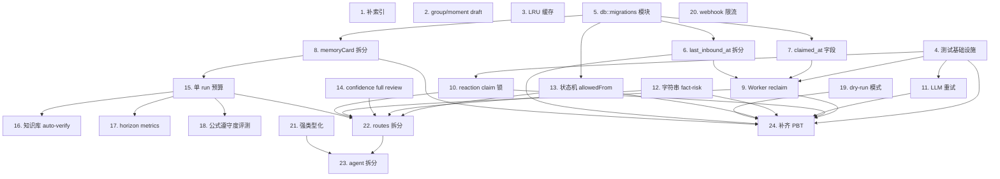

# Implementation Plan

> 中文标题：用户运营 Agent 鲁棒性强化 — 实现计划
>
> 对应文档：`requirements.md`、`design.md`
>
> **⚠️ Sunset Notice (2026-05-25)**：本计划中针对销售域 5 闸 / `enforce_string_fact_risk_guard` /
> `safe_claims` / `routing_card` 的任务条目对应代码已在 knowledge-cleanup 中下线，
> 详见 `requirements.md` 顶部 sunset notice。本文件保留作历史档案。
>
> 执行顺序按 design.md §"部署顺序与回滚策略"分 5 批，每批内部按依赖排序。

## Overview

本计划共 24 个 task，分 5 批执行：

- **第 1 批（Task 1-4）** 低风险独立改动：补索引、group/moment 改 draft、LRU 缓存、测试基础设施。
- **第 2 批（Task 5-8）** 数据迁移基础：`db::migrations` 模块、`last_inbound_at` 拆分、`claimed_at` 字段、memoryCard 拆分。
- **第 3 批（Task 9-14）** 运行时行为变更：Worker 回收、reaction claim 锁、LLM 重试、字符串 fact-risk guard、状态机迁移校验、confidence 触发 full review。
- **第 4 批（Task 15-19）** 成本与可观测性：单 run 预算、知识库 auto-verify、horizon metrics、公式遵守度评测、management dry-run。
- **第 5 批（Task 20-24）** 重构与拆分：webhook 限流、强类型化、routes 拆分、agent 拆分、PBT 补齐。

每个 task 都明确关联了对应的 Requirements 编号，便于追溯。任务依赖见末尾的 Task Dependency Graph。

## Tasks

## 第 1 批 — 低风险独立改动

- [x] 1. 补齐缺失索引到 ensure_indexes
  - 在 `src/db.rs::ensure_indexes` 中增加 `wechat_accounts.{app_id}` sparse 索引
  - 增加 `agent_tasks.{workspace_id, account_id, contact_wxid, kind, status}` 复合索引
  - 增加 `agent_decision_reviews.{workspace_id, account_id, contact_wxid, status, outcome_status}` partial 索引（filter `outcome_status: { $in: ["pending", "analyzing"] }`）
  - 增加 `agent_events.{workspace_id, account_id, contact_wxid, created_at: -1}` 复合索引
  - 验证 `cargo check` 通过；启动一次 wechatagent 后用 `db.collection.getIndexes()` 校验索引存在
  - _Requirements: 13.1, 13.2, 13.3, 13.4, 13.5, 13.6, 13.7_

- [x] 2. group/moment 种子状态改为 draft
  - 修改 `src/prompts.rs`：给 `SoulSpec` 和 `PromptSpec` 增加 `status: &'static str` 字段
  - `soul_specs()` 中 `group` 和 `moment` 两条改为 `status: "draft"`，其它两条 `status: "published"`
  - `prompt_specs()` 中 `group.policy`、`moment.policy` 改为 `status: "draft"`，其它仍 `status: "active"`
  - `ensure_prompt_pack_v2` 的"已存在"检测把 `status: { $in: ["active", "draft"] }` 都视为已种入
  - 把 `find_one` 包在错误处理里：异常时进入 `reset_prompt_pack_v2` 并写 `agent_events kind="prompt_pack_reseed_fallback"`
  - 前端 `frontend/src/App.tsx` 的 souls 和 prompt template 列表组件对 `status === "draft"` 的行加灰色"草稿"badge，sortBy 按 status 升序（active < draft < archived）
  - 前端 `groupOps` / `momentOps` 频道 `NextPhasePanel` 文案改为"对应 Soul 与 Prompt 已存在但运行时未实现，可在系统策略页查看草稿模板"
  - _Requirements: 17.1, 17.2, 17.3, 17.4, 17.5, 17.6, 17.7_

- [x] 3. LLM_EXACT_CACHE 替换为 LRU
  - 在 `Cargo.toml` 添加 `lru = "0.12"`、`parking_lot = "0.12"`
  - 修改 `src/agent.rs` 中 `LLM_EXACT_CACHE` 静态：从 `Mutex<HashMap>` 改为 `parking_lot::Mutex<LruCache<String, Value>>`，容量 256
  - 移除"超 256 整体 clear"逻辑；用 LRU 自动淘汰最久未用项
  - cache key 生成（基于 prompt_key + system + user 的 FNV hash）保持不变
  - 命中时仍写 `llm_call_logs.status = "cache_hit"`
  - _Requirements: 15.1, 15.2, 15.3, 15.4, 15.5, 15.6_

- [x] 4. 测试基础设施
  - 在 `Cargo.toml` 添加 dev-dependencies：`mockall = "0.13"`、`proptest = "1.5"`、`testcontainers = "0.23"`、`testcontainers-modules = { version = "0.11", features = ["mongo"] }`、`fastrand = "2"`
  - 把 `LlmClient` 改为 trait `LlmGenerator`（async-trait）+ impl，`AppState.llm` 改为 `Arc<dyn LlmGenerator>`
  - 用 `mockall::automock` 给 `LlmGenerator` 自动生成 `MockLlmGenerator`
  - 创建 `tests/common/mod.rs`：提供 `TestApp` 工厂（启动 testcontainers MongoDB + 配置 mock LLM + 默认 prompt pack）
  - 集成测试默认 `#[ignore]`（需要 docker），CI 单独跑 `cargo test -- --ignored`
  - 验证 `cargo test` 仍通过现有 7 个 unit test
  - _Requirements: 16.1_

## 第 2 批 — 数据迁移基础

- [x] 5. db::migrations 模块 + 启动调用
  - 创建 `src/db/migrations.rs`，定义 `Migration` struct（id + run fn）和 `MIGRATIONS` 常量数组
  - 实现 `pub async fn run(db: &Database) -> AppResult<()>`，扫描 `migrations` 集合的已应用版本，按顺序执行未应用的迁移并写入版本记录
  - 把 `src/db.rs` 拆为 `src/db/mod.rs`（Database struct + collection accessors）+ `src/db/indexes.rs`（ensure_indexes）+ `src/db/migrations.rs`
  - `main.rs` 在 `Database::connect` 后、其它逻辑前调用 `db::migrations::run(&db).await?`
  - 给 `Database` 加 `pub fn migrations(&self) -> Collection<MigrationRecord>`
  - 添加单元测试：迁移幂等性（运行两次只应用一次）
  - _Requirements: 2.6_

- [x] 6. last_inbound_at / last_outbound_at 字段拆分 + 迁移
  - 修改 `src/models.rs::Contact`：增加 `last_inbound_at: Option<DateTime>`、`last_outbound_at: Option<DateTime>`，保留 `last_message_at`
  - 修改 `src/models.rs::ApiContact`：暴露新字段（camelCase）
  - 修改 `src/webhooks.rs`：入站消息 update_one 同时设置 `last_inbound_at = now`、`last_message_at = now`
  - 修改 `src/agent.rs::send_outbound_message`：用 aggregation pipeline 设置 `last_outbound_at = now`，`last_message_at = max(last_inbound_at, now)`，**不**改 `last_inbound_at`
  - 修改 `src/agent.rs::precheck_send_gateway` 中 follow-up `context_changed` 检查改用 `last_inbound_at > task.created_at`
  - 在 `src/db/migrations.rs` 添加 `2026_05_001_split_last_message_at`：用 `update_many` + aggregation pipeline 把存量 `last_message_at` 复制到 `last_inbound_at`（仅 `last_inbound_at` 缺失时）
  - 添加单元测试：入站只动 inbound、出站只动 outbound、follow-up `context_changed` 正确判定
  - _Requirements: 2.1, 2.2, 2.3, 2.4, 2.5, 2.6_

- [x] 7. claimed_at 字段引入 worker
  - 修改 `src/models.rs::AgentTask`：增加 `claimed_at: Option<DateTime>`、`claim_recovery_count: i32`
  - 修改 `src/tasks.rs::tick`：claim 时 `$set: { claimed_at: now }`
  - 在 `src/main.rs` 中用 `tokio::sync::OnceCell` 记录 `APP_STARTED_AT`（在 `Database::connect` 之前填充）
  - 添加单元测试：claim 后 task 的 claimed_at 非 None
  - _Requirements: 1.2_

- [x] 8. memoryCard 拆分 coreFacts/recentFacts + 迁移
  - 创建 `src/models/memory.rs`，定义 `MemoryCard` 强类型 struct（含 `core_facts: Vec<String>`、`recent_facts: Vec<String>`，移除 `active_facts`）
  - 修改 `src/agent.rs::default_memory_card`：默认 `coreFacts: []`、`recentFacts: []`，移除 `activeFacts`
  - 修改 `src/agent.rs::memory_card_from_contact`：把 contact seed 写入 `coreFacts`（最多 6 条）
  - 修改 `src/agent.rs::compact_memory_card`：合并 previous coreFacts（除非在 discarded 列表里）；按 importance 倒序保留 6 条 coreFacts、10 条 recentFacts
  - 修改 `src/agent.rs::memory_card_has_signal`：把 `coreFacts`/`recentFacts` 加入信号检测
  - 修改 `src/prompts.rs::user.memory_consolidator.task` prompt：要求模型按 importance 倒序输出每个数组，区分 coreFacts/recentFacts，把要 deprecate 的 fact 放 `discarded`
  - 在 `src/db/migrations.rs` 添加 `2026_05_002_split_active_facts`：把存量 `memory_card.activeFacts[0..6]` 移到 `coreFacts`，`activeFacts[6..]` 移到 `recentFacts`
  - 前端 `App.tsx` contact 详情面板分别展示 coreFacts / recentFacts
  - _Requirements: 8.1, 8.2, 8.3, 8.4, 8.5, 8.6_

## 第 3 批 — 运行时行为变更

- [x] 9. Worker stale running 自动回收
  - 在 `src/tasks.rs` 添加 `reclaim_stale_running_tasks(state)` 函数，扫描 `running` 且 `claimed_at < now - timeout`（或 claimed_at 缺失但 updated_at < APP_STARTED_AT）的任务
  - 用 atomic compare-and-set `update_one(filter: { _id, status: "running" }, ...)` 重置为 `retry`，写 `gateway_status="claim_timeout_recovered"`、`next_retry_at=now`，**不**增加 `attempt_count`，但 `claim_recovery_count += 1`
  - 写 `agent_events kind="task_claim_recovered" status="recovered"`，details 含 task_id、kind、previous_attempt_count、stuck_seconds
  - 检查 24h 内 `claim_recovery_count >= 3`：标记 `status="failed"`、`gateway_status="claim_recovery_exhausted"`，写 `agent_events kind="follow_up_failed"` + `kind="claim_recovery_exhausted"`
  - 在 `tick()` 入口先调用 `reclaim_stale_running_tasks` 再走原 claim 逻辑
  - `AppConfig` 新增 `task_claim_timeout_seconds: u64`（默认 300，环境变量 `TASK_CLAIM_TIMEOUT_SECONDS`）
  - 集成测试 `tests/worker_reclaim.rs`：插入 stale running task，跑一次 tick，断言任务变 `retry`、`agent_events` 写入；连续触发 3 次后任务变 `failed`
  - _Requirements: 1.1, 1.3, 1.4, 1.5, 1.6_

- [x] 10. record_user_reaction 加 claim 锁
  - 修改 `src/models.rs::AgentDecisionReview`：`outcome_status` 字符串支持 `"analyzing"` 值；增加 `reaction_claimed_at: Option<DateTime>`
  - 修改 `src/agent.rs::record_user_reaction`：先用 `find_one_and_update` 把符合条件的 review 从 `pending`/null 改为 `analyzing` 并写 `reaction_claimed_at = now`；找不到就直接 return
  - 拿到 review 后调用 LLM 分析，分析后用 `update_one(_id)` 把 outcome_status 写为最终值
  - 在 `tasks::tick` 入口（与 reclaim 同一逻辑批次）加 stuck reaction 兜底：把 `outcome_status="analyzing" AND reaction_claimed_at < now - REACTION_ANALYSIS_CLAIM_TIMEOUT_SECONDS` 重置为 `pending`
  - `AppConfig` 新增 `reaction_analysis_claim_timeout_seconds: u64`（默认 60）
  - 集成测试 `tests/reaction_claim_lock.rs`：spawn 10 个并发 webhook 处理同 contact + mock LLM 计数器，断言 LLM 计数 ≤ 1
  - _Requirements: 3.1, 3.2, 3.3, 3.4, 3.5, 3.6_

- [x] 11. LLM 重试改为指数退避，JSON 错误不重试
  - 修改 `src/llm.rs::is_retryable_llm_error`：移除 `AppError::Json(_)` 分支
  - 修改 `src/llm.rs::generate_json_with_usage`：用指数退避 `base * 2^(attempt-1) + jitter(0..base)`；从响应 `Retry-After` header 取秒数（要先在 `generate_json_once` 内保留响应 headers），实际等待 = `max(指数退避, Retry-After * 1000)`
  - 把 `retry_base_ms` 默认改为 1000，`max_retries` 仍 3
  - 修改 `LlmJsonResult`：增加 `retry_count: u32`
  - 修改 `src/models.rs::LlmCallLog`：增加 `retry_count: i32`、`final_status: String`
  - 修改 `src/agent.rs::generate_agent_json`：把 retry_count 和 final_status 写入 llm_call_logs
  - 引入 `fastrand` crate 用于 jitter
  - 单元测试 `tests/llm_retry_jitter.rs`：mock 返回 429 + `Retry-After: 5`，断言总等待 ≥ 5s；mock 返回非 JSON 内容，断言只调一次（无重试）
  - _Requirements: 4.1, 4.2, 4.3, 4.4, 4.5, 4.6_

- [x] 12. 字符串级 fact-risk 兜底 guard
  - 在 `src/agent.rs`（或 `src/agent/guards.rs`）新增 `ProductClaimMarkers` struct，含 markers（literal/regex pattern + reason）和 whitelist phrases（含 window_chars）
  - 实现 `ProductClaimMarkers::scan(reply_text) -> Vec<MarkerHit>`、`passes_whitelist(hit) -> bool`
  - 在 `src/prompts.rs::prompt_specs()` 添加新 prompt key `user.review.product_claim_markers`，其 content 是 JSON（含上述 markers/whitelist）
  - 启动时从 prompt_templates 读取并缓存到 `AppState`（`Arc<RwLock<ProductClaimMarkers>>`），后台编辑后通过现有 prompt template publish 接口刷新
  - 修改 `src/agent.rs::enforce_decision_guards`：增加调用 `enforce_string_fact_risk_guard`，触发时 fact_risk = max(_, 6)、product_accuracy = min(_, 6)、写 `risks` 含 `"string_guard:"` 前缀
  - 跳过条件：`claim_analysis.requiresProductKnowledge=false && knowledgeSupported=true`、或 `used_knowledge_ids.is_empty() && safe_claims_used.is_empty() == false`
  - 单元测试 `tests/string_fact_risk_guard.rs`：4+ case（命中 / 白名单豁免 / 模型已声明 safe / 已引用知识）
  - _Requirements: 6.1, 6.2, 6.3, 6.4, 6.5, 6.6, 6.7, 6.8_ 

- [x] 13. 状态机 allowedFrom 校验
  - 修改 `src/prompts.rs::default_user_operation_state_machine`：每个 state 加 `allowedFrom`（按 design 中给定的合理默认）；`cooldown` 加 `allowFromAny: true`
  - 在 `src/agent.rs`（或新 `agent/guards.rs`）添加 `OperationStateSpec` 反序列化辅助 struct（含 allowedFrom/allowFromAny），`fn check_state_transition(decision, contact, config) -> Option<String>`
  - 修改 `enforce_decision_guards`：调用 `check_state_transition`，非法时 fact_risk=max(_,6)、approved=false、push 一条 `state_transition_invalid: from=<a> to=<b>` 到 risks
  - 数据迁移 `2026_05_003_state_machine_allowed_from`：对存量 `operation_domain_configs.user_operations`，如果 `state_machine.states[i].allowedFrom` 缺失则按默认补齐
  - 前端 `App.tsx` 系统策略 → 状态机编辑：始终暴露 allowedFrom 编辑能力，对 `allowFromAny=true` 的 state 把 allowedFrom 渲染为只读 + 提示"该状态允许从任意状态迁入"
  - PBT 测试 `tests/state_transition_pbt.rs`：proptest 随机生成 (from, to) 对，断言 `should_allow ⇔ ¬blocked`
  - _Requirements: 7.1, 7.2, 7.3, 7.4, 7.5, 7.6, 7.7_

- [x] 14. 消费 operation_state_confidence 触发 full review
  - `OperationDomainConfig.runtime_parameters` 添加默认字段 `operationStateConfidenceFullReviewBelow: 4`
  - 修改 `src/agent.rs::UserRuntimeParameters::from_config`：读取该字段（默认 4）
  - 修改 `src/agent.rs::effective_review_mode`：在原条件之外增加 `if confidence < threshold => "full"`，并在 `agent_run_logs.planner.confidence_override_triggered = true`
  - `confidence` 缺失视为 10（最高），不强制 full
  - 单元测试：confidence=3 + planner.knowledge_required=false 触发 full；confidence=8 走原判定
  - _Requirements: 10.1, 10.2, 10.3, 10.4, 10.5, 10.6_

## 第 4 批 — 成本与可观测性

- [x] 15. 单 run LLM 预算与降级链
  - 创建 `src/agent/budget.rs`：`RunBudget` struct（token_budget / max_llm_calls / tokens_used / llm_calls_used / degraded_reasons）
  - `Arc<Mutex<RunBudget>>` 形式由 `run_user_operation_gateway` 创建并向下传递
  - 在 `agent::generate_agent_json` 调用方包装：每次返回后调 `budget.lock().record_call(&usage)`；超额时返回 `AppError::BudgetExceeded`
  - 添加 `AppError::BudgetExceeded` 变体（IntoResponse 返回 503，但内部主流程会捕获走降级）
  - 在 `decide_reply / review_decision / route_operation_knowledge / record_user_reaction / consolidate_contact_memory` 入口处检查预算，超额时各自降级（review → local_decision_review、router 二次跳过、reaction → user_replied_unclassified、consolidator → 跳过）并 mark_degraded
  - 修改 `src/models.rs::AgentRunLog`：增加 token_budget / tokens_used / llm_calls_used / degraded_reasons
  - `OperationDomainConfig.runtime_parameters` 添加 `runTokenBudget: 30000`、`runMaxLlmCalls: 6`、`simulationTokenBudget: 60000`
  - 写 `agent_events kind="run_budget_exceeded" status="degraded"`
  - 单元测试：构造低 budget，run 完成后 degraded_reasons 含相应字符串、review 未调 LLM
  - _Requirements: 5.1, 5.2, 5.3, 5.4, 5.5, 5.6, 5.7_

- [x] 16. 知识库未验证告警 + auto-verify 接口
  - 在 `src/agent.rs::load_operation_knowledge` 调用后或 run 入口添加 `maybe_emit_unverified_warning`：检测 `total_chunks > 0 && verified_chunks == 0`，当日按 contact_wxid 去重写 `agent_events kind="knowledge_unverified_warning" status="warn"`
  - 添加新接口 `POST /api/operation-knowledge/auto-verify`，body `{ accountId, confidenceThreshold = 7, humanAuditSampleRate = 0.1 }`
  - 实现：串行处理 `needs_review` chunks，每条调 LLM `knowledge.auto_verify` prompt（新建）评估 confidence；按 threshold 自动标 verified；按 sampleRate 随机标 `needs_human_audit`；受 RunBudget 约束（复用 simulationTokenBudget）
  - 添加 prompt template `knowledge.auto_verify`（system + task）：要求模型读 chunk + source_anchors，输出 `{ confidenceScore: 0-10, integrityStatus, verifiedClaims, distortionRisks }`
  - 写 `agent_events kind="knowledge_auto_verify_done"`，含 verified/needs_review/needs_human_audit 计数
  - 前端 `App.tsx` 知识库面板顶部显示 `verified` 占比和未验证条数；占比 > 50% 显示橙色警示
  - _Requirements: 9.1, 9.2, 9.3, 9.4, 9.5, 9.6, 9.7_

- [x] 17. 长 horizon outcome metrics
  - 在 `src/db.rs` 添加 `agent_outcome_metrics` collection accessor + TTL 索引（`{ created_at: 1 }` expireAfterSeconds = 90d，可配置 `OUTCOME_METRICS_TTL_DAYS`）
  - 添加 `AgentOutcomeMetric` struct：account_id / horizon / date / reply_rate / conversation_depth / human_handoff_success_rate / agent_block_rate / daily_run_count / daily_run_token_total
  - 在 `src/tasks.rs` 添加新 task kind `outcome_aggregation`，入口处确保当日所有 (account, horizon) 都有任务
  - 实现 handler：聚合 24h 数据，按公式计算各指标，写入 `agent_outcome_metrics`（_id = "{account_id}:{horizon}:{date}"）
  - 添加新接口 `GET /api/agent-outcome-metrics?accountId=&horizon=7d|30d&fromDate=&toDate=`
  - 单元测试：插入合成数据，跑 handler，断言指标计算正确
  - _Requirements: 19.1, 19.2, 19.3, 19.4, 19.5, 19.6, 19.7_

- [x] 18. 公式遵守度评测脚手架
  - 在 `src/db.rs` 添加 `evaluation_scenarios` collection
  - 添加 `EvaluationScenario` 模型 + CRUD 接口（`GET /api/evaluation-scenarios`、`POST /api/evaluation-scenarios`、`PUT/DELETE /api/evaluation-scenarios/:id`）
  - 添加新接口 `POST /api/user-operations/evaluations/formula-adherence`：加载场景（或按 scenarioIds/tags 过滤），逐个调 `simulate_user_dialogue`，抓最后一 turn 的 `decision.formula_breakdown` + `review.scores`，对比 ground_truth 计算偏差和 adherence_score
  - 受 simulationTokenBudget 约束，超额返回部分结果 + `degraded: true`
  - **降级**：当 evaluation_scenarios 为空时返回 `200 OK + summary: { degraded: true, reason: "no_scenarios" } + items: []`
  - 启动时通过 `ensure_evaluation_scenarios` 幂等写入示例场景 `example_high_intent_user`
  - 写 `agent_events kind="formula_adherence_evaluated"`
  - _Requirements: 18.1, 18.2, 18.3, 18.4, 18.5, 18.6, 18.7, 18.8_

- [x] 19. Management Agent dry-run 模式
  - 修改 `src/models.rs::ManagementAgentSession`：增加 `dry_run: bool`（默认 false）
  - 修改 `src/routes.rs::CreateSessionRequest`：接受 `dryRun: bool`，写入 session
  - 修改 `src/routes.rs::ManagementMessageRequest`：增加 `dryRun: Option<bool>` 单次覆盖
  - 在 `post_management_message` 计算 `effective_dry_run = request.dry_run.unwrap_or(session.dry_run)` 并传给 `execute_management_tool`
  - 修改 `execute_management_tool`：当 `effective_dry_run && !is_read_tool(tool_name)` 时，返回 `{ "dry_run": true, "would_execute": { toolName, arguments } }` 不实际执行
  - 实现 `is_read_tool`：返回 `account_list / contacts_search / knowledge.search / knowledge.list_catalog / wechatagent.search_contacts / knowledge.open*` 为 true；`wechatagent.import_contacts` 归类为写工具
  - 处理锁定 send 内容失败（apply_locked_send_content 异常）：仍以 dry-run 形式返回，把失败信息写入 `would_execute.arguments.content` 和 `would_execute.error`
  - 修改 `agent_command_runs.status` / `agent_tool_calls.status` 在 dry-run 时设为 `"dry_run"`
  - 前端 `App.tsx` session 创建 + 单条消息发送都加 dry-run checkbox（始终显示）；session 详情顶部固定模式徽章
  - 集成测试 `tests/dry_run_isolation.rs`：dry_run=true 时所有业务集合状态不变（仅审计集合写入）
  - _Requirements: 20.1, 20.2, 20.3, 20.4, 20.5, 20.6, 20.7, 20.8, 20.9_

## 第 5 批 — 重构与拆分

- [x] 20. Webhook per-account 限流
  - `Cargo.toml` 添加 `governor = "0.7"`、`dashmap = "6"`
  - 在 `src/webhooks.rs` 实现 per-`account_id` 令牌桶（`DashMap<String, Arc<DefaultDirectRateLimiter>>` + `governor`）
  - `AppConfig` 新增 `webhook_rate_limit_window_seconds: u32`（默认 60）、`webhook_rate_limit_capacity: u32`（默认 30）
  - 限流命中：返回 HTTP 429 + `Retry-After` header + body `{"error":"rate_limited","account_id":"..."}`
  - 写 `agent_events kind="webhook_rate_limited" status="blocked"`，按 account 当日去重
  - `AppError::RateLimited { retry_after, account_id }` 新变体；IntoResponse 实现返回 429 + header
  - 解析不出 account_id 时限流应用到 `default`
  - 集成测试：连续 31 次相同 account 请求，断言第 31 次返回 429
  - _Requirements: 14.1, 14.2, 14.3, 14.4, 14.5, 14.6_

- [x] 21. 核心 Document 字段强类型化
  - 创建 `src/models/runtime.rs`：`RuntimeParameters` struct + `defaults` 子模块 + `From<RuntimeParameters> for Document` 实现
  - 创建 `src/models/memory.rs`：`MemoryCard`、`MemoryCardCoreProfile`、`MemoryCardRelationshipState`、`UserUnderstanding`、`ProductFit`、`NextActionMemory`（都用 `#[serde(rename_all = "camelCase")]` + `#[serde(default)]`）+ From 实现
  - 给 `OperationDomainConfig` 加辅助方法 `runtime_parameters_typed(&self) -> RuntimeParameters`
  - 把 `agent.rs::UserRuntimeParameters::from_config` 改为读取 `runtime_parameters_typed()` 返回的强类型
  - 把 `compact_memory_card` / `consolidate_contact_memory` 改为消费/产出 `MemoryCard` 强类型
  - 保留现有 Document 字段以兼容老调用点；后续小迭代再彻底替换
  - _Requirements: 12.1, 12.2, 12.3, 12.4, 12.5, 12.6_

- [x] 22. routes.rs 拆分到 src/routes/ 子模块
  - 创建 `src/routes/mod.rs`：保留 `AppState`、`api_router`、`pub use` 子模块的入口
  - 拆分 `src/routes.rs` 内容到子模块：`accounts.rs / contacts.rs / conversations.rs / tasks.rs / events.rs / assets.rs / knowledge.rs / playbooks.rs / domains.rs / prompt_templates.rs / souls.rs / reviews.rs / evaluations.rs / simulations.rs / management.rs / guides.rs / outcome_metrics.rs / health.rs / shared.rs`
  - `shared.rs` 收纳跨模块 helpers（`parse_object_id` / `validate_account` / `find_contact_by_id` / `upsert_contact_from_value` 等）
  - 每个子模块顶部加 `//!` 中文 doc-comment 说明职责
  - 验证 `cargo check` + `cargo test` 全通过；现有 API 形状不变
  - 删除原 `src/routes.rs`
  - _Requirements: 11.1, 11.3, 11.4, 11.5, 11.6, 11.7_

- [x] 23. agent.rs 拆分到 src/agent/ 子模块
  - 创建 `src/agent/mod.rs`：保留 type alias / `pub use`、入口 fn（`run_user_operation_gateway` / `handle_managed_message` / `handle_follow_up_task` / `handle_memory_consolidation_task` / `consolidate_contact_memory` / `record_user_reaction` / `send_contact_message_gateway` / `simulate_user_dialogue` / `test_knowledge_route_for_contact` / `build_initial_operation_profile` / `write_event_for_account` 等）
  - 拆分到子模块：`types.rs / runtime.rs / gateway.rs / decision.rs / review.rs / knowledge_router.rs / memory.rs / reaction.rs / simulation.rs / guards.rs / budget.rs`
  - 每个子模块顶部加 `//!` 中文 doc-comment 说明职责
  - 验证 `cargo check` + `cargo test` 全通过；行为不变
  - 删除原 `src/agent.rs`
  - _Requirements: 11.2, 11.3, 11.4, 11.5, 11.6, 11.7_

- [x] 24. 补齐 PBT 与回归测试
  - `tests/state_transition_pbt.rs`：proptest 验证 Property 1（≥3 属性 cases）
  - `tests/memory_card_invariants.rs`：proptest 验证 Property 2（`coreFacts ≤ 6 && recentFacts ≤ 10 && coreFacts 保留性`）
  - `tests/reaction_claim_lock.rs`：N=10 并发 webhook，断言 LLM 计数 ≤ 1（与任务 10 中的测试合并）
  - `tests/worker_reclaim.rs`：HP-1 回归（与任务 9 合并）
  - `tests/last_inbound_split.rs`：HP-2 回归（与任务 6 合并）
  - `tests/llm_retry_jitter.rs`：HP-4 回归（与任务 11 合并）
  - `tests/string_fact_risk_guard.rs`：MP-6 正反测试（与任务 12 合并）
  - `tests/dry_run_isolation.rs`：S-20 隔离 PBT（与任务 19 合并）
  - `tests/happy_path_run.rs`：mock LLM + testcontainers MongoDB happy-path 集成测试
  - 整体 `cargo test` 不超过 90 秒；testcontainers 集成测试用 `#[ignore]` 隔离
  - _Requirements: 16.2, 16.3, 16.4, 16.5, 16.6, 16.7_

## Task Dependency Graph




```json
{
  "waves": [
    {
      "wave": 1,
      "tasks": [1, 2, 3, 4],
      "rationale": "第 1 批低风险改动，4 个 task 完全独立，可并行执行"
    },
    {
      "wave": 2,
      "tasks": [5],
      "rationale": "迁移模块是后续数据迁移的前置条件，必须先就位"
    },
    {
      "wave": 3,
      "tasks": [6, 7, 8],
      "rationale": "三组数据迁移彼此独立，可并行；都依赖 Task 5 的迁移框架"
    },
    {
      "wave": 4,
      "tasks": [11, 12, 14],
      "rationale": "运行时行为变更中无 schema 依赖的部分；可并行（11=LLM 重试、12=字符串 guard、14=confidence full review）"
    },
    {
      "wave": 5,
      "tasks": [9, 10, 13],
      "rationale": "依赖前序数据迁移：9 需要 6/7、10 需要 4 的测试基础设施 mock LLM、13 需要 5 的迁移框架"
    },
    {
      "wave": 6,
      "tasks": [15],
      "rationale": "单 run 预算是后续 4 批成本相关 task 的依赖"
    },
    {
      "wave": 7,
      "tasks": [16, 17, 18, 19],
      "rationale": "成本与可观测性的 4 个独立特性，都依赖 Task 15 的预算框架"
    },
    {
      "wave": 8,
      "tasks": [20, 21],
      "rationale": "限流和强类型化彼此独立、且不影响重构拆分的边界"
    },
    {
      "wave": 9,
      "tasks": [22],
      "rationale": "routes 拆分必须在所有 routes 相关 task 之后执行，否则会产生大量合并冲突"
    },
    {
      "wave": 10,
      "tasks": [23],
      "rationale": "agent 拆分必须在所有 agent 相关 task 之后执行；同时依赖 Task 21 的强类型化"
    },
    {
      "wave": 11,
      "tasks": [24],
      "rationale": "PBT 与回归测试统一收尾，依赖前序所有功能 task 的稳定状态"
    }
  ]
}
```

## Notes

### 执行顺序与依赖关系

- **强依赖**：Task 5（migrations 模块）必须在 Task 6/7/8/13 之前；Task 4（测试基础设施）必须在 Task 9/10/11/24 之前；Task 22/23（拆分）必须放最后。
- **弱依赖**：依赖图中的弱连边（如 Task 12 → Task 22）表示"建议但非阻塞"，主要是为了减少代码冲突。
- **wave 内并行**：同一 wave 内的 task 可完全并行，互不影响。

### 数据迁移可重入性

所有迁移任务（Task 6/7/8/13）通过 `migrations` 集合记录已执行版本，启动时幂等执行。如需回滚某次迁移：

1. 删除 `migrations` 集合中对应版本记录
2. 手动 revert 该 task 的代码改动
3. 重启服务即可恢复

### 测试策略

- **单元测试**：每个 task 都自带单元测试（在 task 描述里注明）
- **集成测试**：Task 4 提供 testcontainers + mock LLM 基础设施；后续 task 的集成测试在 `tests/` 目录下，默认 `#[ignore]`，CI 跑 `cargo test -- --ignored`
- **PBT**：Task 24 集中收尾 6 条 Property（与 design.md §Correctness Properties 对应）

### 验证清单

每批执行完毕后必须通过：

1. `cargo check`（无编译错误）
2. `cargo test`（单元测试 + 非 ignored 测试 ≤ 90s 全通过）
3. `cargo test -- --ignored`（集成测试全通过，需要 docker）
4. 前端 `cd frontend && npm run build`（前端涉及改动时）
5. 启动一次服务，跑通"webhook 入站 → managed contact → review pass → 出站"完整链路（人工冒烟）

### 回滚预案

- 每个 task 都是独立 commit；线上出问题先 `git revert` 对应 commit
- 数据迁移类 task 额外清理 `migrations` 集合中对应 version 记录
- 拆分类 task（22/23）回滚需要谨慎，因为子模块多；推荐在拆分前打 `pre-refactor` tag，必要时直接 reset 到 tag

### 实现分工建议

- 单人执行：按 wave 1→11 串行
- 多人并行：wave 1/3/4/5/7 内部可分配多人；其它 wave 强串行
